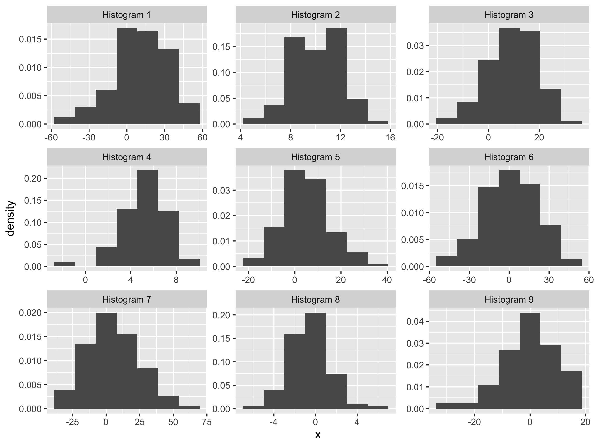
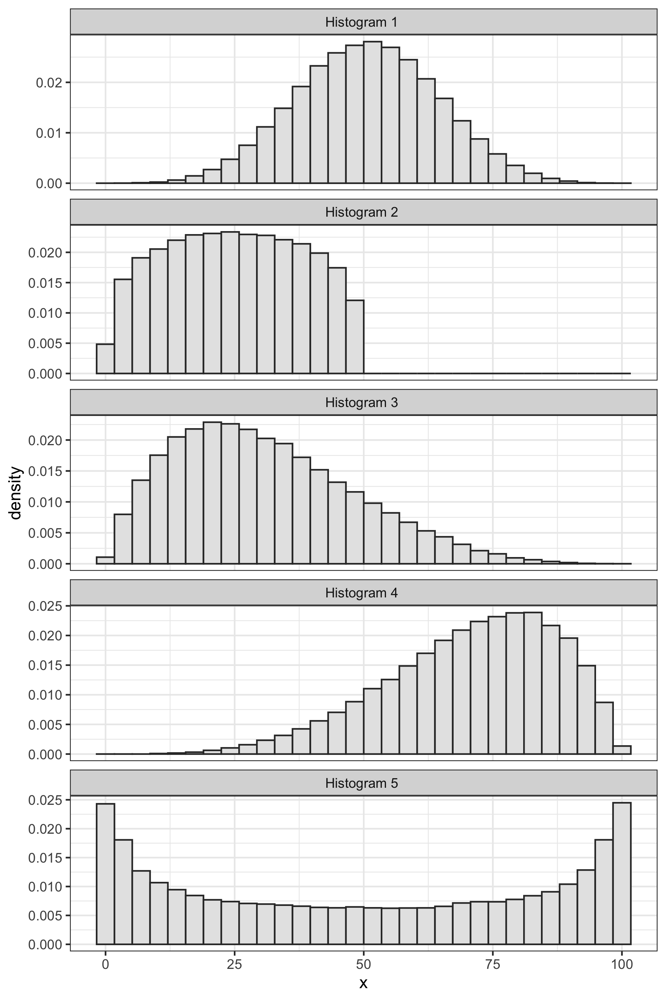
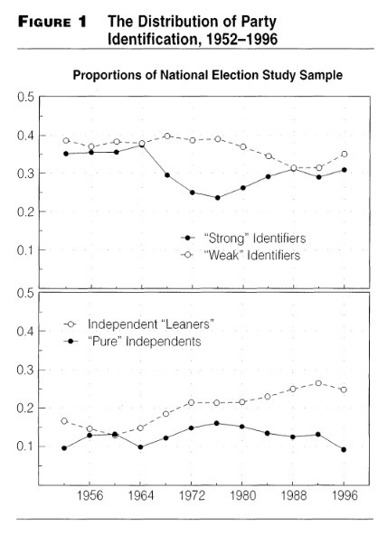
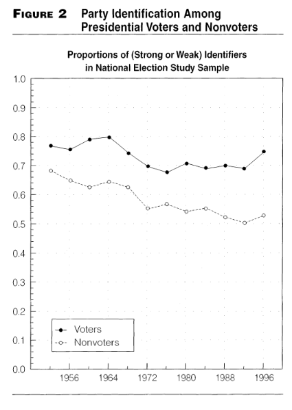

---
output:
  html_document: default
  pdf_document: default
---

# Average and SD

```{r setup, include=FALSE}
# packages for entire chapter
library(tidyverse)
library(ggtext)
library(kableExtra)

# options for entire document
knitr::opts_chunk$set(echo = TRUE)

# ggplot theme for entire document
doc_theme <- theme_bw() 
```

## The Intuition

If we took a histogram and tried to describe it to someone else without showing it to them, the **most** important pieces of information are usually the **average** and **standard deviation or SD**.

We might describe the variable this way: **"The values are about __________, give or take ________ or so."** We can think of the first blank as the average and the second blank as the SD.

1. The **average** describes where the histogram is positioned along the left-right axis. 
1. The **SD** describes the width (or "spread" or "dispersion") of the histogram.

Note that the average and SD are not the *only* way to describe the "location" and "width" ("dispersion," "spread", or "scale") of the histogram, but they are the most common.

Inspect the collection of 20 numbers below. Fill in the blanks: **"The values are about __________, give or take ________ or so."**

```{r echo=FALSE, message=FALSE, warning=FALSE}

set.seed(13414)
x <- rnorm(10)
x <- x - mean(x)
df <- tibble(x = c(-abs(x), abs(x))) %>%
	mutate(x = (x - mean(x))/sd(x),
				 x = round(x, 1),
				 x = x*10, 
				 x = x + 80)
labs <- tribble(
  ~label, ~x, ~yend, ~y,
  "about 80",   80, 0, 0.007,
  "**give** or take 10 or so",   90, 0, 0.003,
   "give or **take** 10 or so",   70, 0, 0.003
)

kableExtra::kable(matrix(df$x,ncol = 5), format = "markdown")


```


If we had to describe these data, we might say that our variable is "about 80, give or take 10 or so." We can also visually these two summaries with a histogram.

```{r echo=FALSE, message=FALSE, warning=FALSE, fig.width=6, fig.height=4}
ggplot(df, aes(x = x, y = ..density..)) + 
  geom_histogram(fill = "grey80", bins = 7) + 
  stat_density(geom = "line", size = 1.5) + 
	geom_segment(data = labs, aes(x = x, xend = x, y = y, yend = yend),
							 arrow = arrow(length = unit(0.07, "inches"))) + 
	geom_richtext(data = labs, aes(x = x, y = y, label = label)) + 
  doc_theme + 
	labs(title = '"About 80, give or take 10 or so"')
```

While this variable has a particular average (about 80), we can imagine shifting it left or right. The figure below shows some possible shifts. We could shift it way to the left, so that it's "about 40" or a little bit to the right so that it's "about 90."

```{r echo=FALSE, fig.height=3.5, fig.width=6, message=FALSE, warning=FALSE}
shift_df <- tibble(shift = c(-40, -10, 0, 10, 40), 
                   label = c("a big shift left",
                             "a small shift left",
                             "the original variable",
                             "a small shift right",
                             "a big shift right"))

shift2_df <- filter(shift_df, shift != 0)
mdf2 <- shift2_df %>%
  split(.$label) %>%
  map(~ mutate(df, 
               new_x = x + .$shift,
               label = .$label,
               shift = .$shift)) %>%
  bind_rows() %>%
  mutate(label = reorder(label, shift)) 

ann_df <- mdf2 %>%
  group_by(label, shift) %>%
  summarize(x = mean(x),
            xend = mean(new_x),
            y = 0.03) %>%
  mutate(yend = y)

ggplot(mdf2, aes(x = x, 
                y = ..density..)) + 
  facet_wrap(vars(label)) + 
  #stat_density(geom = "line", position = "identity") + 
  geom_density(fill = "grey80", color = NA) + 
  stat_density(aes(x = new_x), geom = "line", position = "identity", trim = FALSE) +
  geom_segment(data = ann_df, aes(x = x, xend = xend, y = y, yend = yend),
               size = 0.3, color = "grey50",
               arrow = arrow(length = unit(0.1,"cm"))) + 
	scale_x_continuous(breaks = c(seq(0, 140, by = 10))) + 
  doc_theme 
```

We can also imagine increasing the SD (more spread) or decreasing the SD (less spread). The figure below shows some possible changes in the SD. In each case, the "give or take" number is changing.

```{r echo=FALSE, fig.height=3.5, fig.width=6, message=FALSE, warning=FALSE}

shift_df <- tibble(shift = c(.5, 0.75, 1, 1.5, 3), 
                   label = c("a big decrease in SD",
                             "a small decrease in SD",
                             "the original variable",
                             "a small increase in SD",
                             "a big increase in SD"), 
                   x0 = c(2.5, 1.5, 0,  1.5, 0.5),
                   x1 = c(1, 1, 0, 2, 2))

shift2_df <- filter(shift_df, shift != 1)
mdf2 <- shift2_df %>%
  split(.$label) %>%
  map(~ mutate(df, 
               new_x = (x - mean(x)),
  						 new_x = new_x*.$shift + mean(x),
               label = .$label,
               shift = .$shift)) %>%
  bind_rows() %>%
  mutate(label = reorder(label, shift))

ann_df_right <- mdf2 %>%
  left_join(shift_df) %>%
  mutate(y0 = .03,
         y1 = y0, 
  			 x0 = x0*10 + 80,
  			 x1 = x1*10 + 80) %>%
  mutate(label = reorder(label, shift))
ann_df_left <- ann_df_right %>%
  mutate(x0 = -x0 + 160,
          x1 = -x1 + 160)
ann_df <- bind_rows(ann_df_left, ann_df_right)

ggplot(mdf2, aes(x = x, 
                y = ..density..)) + 
  facet_wrap(vars(label)) + 
  #stat_density(geom = "line", position = "identity") + 
  geom_density(fill = "grey80", color = NA) + 
  stat_density(aes(x = new_x), geom = "line", position = "identity", trim = FALSE) +
  geom_segment(data = ann_df, aes(x = x0, xend = x1, y = y0, yend = y1),
               size = 0.3, color = "grey50",
               arrow = arrow(length = unit(0.1,"cm"))) + 
  doc_theme 
```

```{exercise}
For the following nine lists, choose whether the average is 0, 5, or 10 and the SD is 2, 10, or 20. You don't need to do any calculation.

1. -22, -10, 35, 7, -29, 14, 9, -3, 23, 27
1. -14, 17, 5, 8, 16, 12, 14, 16, 3, 24
1. 10, -13, 6, 6, 4, -1, -8, 19, 6, 21
1. 27, 37, -11, -23, 24, 15, -10, 2, 36, 2
1. 5, 6, 6, 2, 3, 3, 9, 4, 6, 6
1. -12, -3, 9, 11, -1, 2, -7, 3, 16, -18
1. 12, 12, 9, 10, 12, 12, 6, 10, 11, 7
1. 0, -2, 0, 3, 3, 0, -2, -3, -1, 2
1. -3, 28, 12, 7, 25, 3, -38, -25, 7, -16
```
<details><summary>Solution</summary><p>
```{R, echo = FALSE, include=FALSE}
list_number <- c(1:9)
list_mean <- c(5, 10, 5, 10, 5, 0, 10, 0, 0)
list_sd <- c(20, 10, 10, 20, 2, 10, 2, 2, 20)

list_answers <- tibble(List = list_number,
       Mean = list_mean,
       SD = list_sd)%>%
  glimpse()

kable(list_answers)%>%
  kable_styling()
```
```{R, echo=FALSE}
kable(list_answers)%>%
  kable_styling()
```
</p></details>
```{r include=FALSE}
# Histograms
n <- 100
prec <- 0.1
n_draws <- 5000

sd0 <- function(x) {
	d <- x - mean(x)
	sqrt(mean(d^2))
}

search_pars <- list("mu" = c(0, 5, 10), "sigma" = c(2, 10, 20))

df <- NULL
group <- 0
for (i_mu in 1:length(search_pars$mu)) {
	mu <- search_pars$mu[i_mu]
	for (i_sigma in 1:length(search_pars$sigma)) {
		group <- group + 1
		sigma <- search_pars$sigma[i_sigma]
		draws <- round(rnorm(n_draws*n, mu, sigma))
		mat <- matrix(draws, nrow = n_draws)
		avgs <- apply(mat, 1, mean)
		sds <- apply(mat, 1, sd0)
		keep_index <- abs(avgs - mu) < prec & abs(sds - sigma) < prec
		keep_mat1 <- matrix(mat[keep_index, ], ncol = n)
		vals <- keep_mat1[1, ]
		df0 <- tibble(group = group, x = vals)
		df <- bind_rows(df, df0)
	}
}

## randomize groups
r_df <- tibble(group = 1:9) %>%
	mutate(rgroup = sample(1:9)) %>%
	mutate(fgroup = paste0("Histogram ", rgroup)) %>%
	glimpse()

df2 <- df %>%
	left_join(r_df)
# creat df to make kable of solutions
histograms_answers <- df2%>%
  rename(Histogram = fgroup)%>%
  group_by(Histogram)%>%
  summarise(Mean = round(mean(x), 2),
            SD = round(sd(x), 2))%>%
#  mutate(Histogram = fgroup)%>%
  glimpse()

ggplot(df2, aes(x = x, y = ..density..)) + 
	geom_histogram(bins = 7) + 
	facet_wrap(vars(fgroup), scales = "free")
ggsave("exercises/ex-3242.png", height = 6, width = 8)
```


```{exercise}
For the following nine histograms, choose whether the average is 0, 5, or 10 and the SD is 2, 10, or 20. You don't need to do any calculations.


```
<details><summary>Solution</summary><p>
```{R, echo = FALSE}
histograms_answers%>%
  kable()%>%
  kable_styling()

```
</p></details>
## The Measures 

### The Average

The most common measure of the location of a variable is the average.^[Some people refer to the "average" as the "mean". I prefer to avoid this because the "mean" might also refer to the expectation of a random variable. I use "average" and "expected value" to differentiate these two meanings.] Suppose we have a variable (a list of numbers) $X = \{x_1, x_2, ..., x_n\}$. 

\begin{equation}
\text{average} = \dfrac{\text{the sum of the list}}{\text{the number of entries in the list}} = \dfrac{\sum_{i = 1}^n x_i}{n} \nonumber
\end{equation}

The average is easy to compute and easy to work with mathematically.^[The median, alternatively, is not easy to compute and quite difficult to work with mathematically.] 

Unfortunately, the average doesn't have an easy interpretation. The best interpretation, in my mind, is as the balance-point for the data. If we imagine the left-right axis as a teeter-totter and stack the data along the beam according to their values, then the average is the position of the fulcrum that would balance the data-filled beam.

```{r echo=FALSE, fig.height=6.2, fig.width=9, message=FALSE, warning=FALSE}
set.seed(1234)
df <- tibble(x = rchisq(1000, df = 5))
ggplot(df, aes(x = x)) + 
  geom_dotplot(binwidth = .3, fill = "grey90") + 
  theme_void() + 
  theme(axis.line.x.bottom = element_line(size = 1), 
        axis.text.x = element_text(),
        axis.ticks.x = element_line(size = 0.5),
        axis.ticks.length.x = unit(.5, "cm")) + 
  scale_y_continuous(expand = expand_scale(mult = c(.005, .5))) + 
  #scale_x_continuous(breaks = c(quantile(df$x, 0.2), mean(df$x), quantile(df$x, 0.85)), labels = c("Would Fall\nto the Right", "Balance\nPoint", "Would Fall\nto the Left")) + 
	scale_x_continuous(breaks = mean(df$x), labels = c("Balance\nPoint")) 

```

```{exercise}
Compute the average of the following lists of numbers. Round to two decimals placed as necessary.

1. \{0, 1\}
1. \{0, 0, 1}
1. \{0, 1, 1\}
1. \{0, 10\}
1. \{0, 1, 2\}
1. \{3, 6, 7, 1\}
1. \{8, -4, 16, 4, 7\}
1. \{7, -4, 7, 7, -4\}
```

```{exercise}
Suppose the entries in a list are between 1 and 10 (including both 1 and 10). What is the lowest possible average? What is the highest possible average?
```

```{exercise}
To find the percent of observations that fall into a particular category, I count the number of observations *in that category* and divide that by the total number. That number lies between 0 and one. We refer to that number as a "proportion." To convert the proportion to a percent, we just multiply the proportion times 100%.

Suppose I asked 10 survey respondents whether they voted in the previous presidential election and obtained the following responses: \{Yes, No, No, No, Yes, Yes, No, No, No, No\}. What percent said "Yes"? What if I changed the "Yes" responses to the number 1 and the "No" responses to the number 0, then found the average? Is that related to the percent that said "Yes"? Is  counting the "Yes" responses like changing them to ones, changing everything else to 0, and adding up the 0s and 1s?
```

```{exercise}
Suppose a list of 10 numbers with an average of 50. If I add the number 100 to the list, what is the average of all 11 numbers?
```

<details><summary>Solution</summary><p>
If the average of the ten numbers is 50, then the sum of the ten numbers must be 500. If the sum of the ten numbers is 500, then the sum of the eleven numbers is 600. Since the sum of the eleven numbers is 600, the average is 600/11 = 54.55.
</p></details>

### The Median

When we're describing the location of a variable (or, visually, of the histogram), we typically use the average. However, some researchers use the median. I introduce the median as an alternative to the average for two reasons. First, it helps us better understand the average conceptually. Second, you might encounter it, so it's good to understand how the median works.

The median is the (or one of the) numbers that divides the variable (or, visually, the histogram) into two equal pieces. 

For example, the number 3 divides the variable $X = \{1, 2, 2, 3, 4, 6, 8\}$ into two equal pieces. The three values 1, 2, and 2 fall below the number 3. The three values 4, 6, and 8 fall above 3. Because 3 splits the variable into two equal pieces, it is the median.

If you order the variable from highest to lowest, you can think of the median as the "middle" value.

Notice, though, that things can run amok when we have an even number of observations in our variable. Consider the variable $X = \{1, 2, 2, 4, 6, 8\}$. There is no "middle" value here. 

Notice that the values 3, 2.7, and 3.76421 all split the variable into equal pieces (1, 2, and 2 fall below each of these values; 4, 6, and 8 fall above). This means that there are mmany values that split the variable into equal pieces. But it isn't very helpful---we need a single median to summarize the variable.

When the number of observations in the variable is even, we just find the *two* middle values and split the difference. For the variable $X = \{1, 2, 2, 4, 6, 8\}$, the numbers 2 and 4 are the two middle numbers. To "split the difference," we just average them. The average of 2 and 4 is (2 + 4)/2 = 3. In this case, then, the median is three.

In summary, we find the median with the following algorithm:

1. Order the values from lowest to highest.
1. If the number of values is odd, then just find the middle value.
1. If the number of values is even, then find the *two* middle values and split the difference (or average them).

```{exercise}
Find the average and median of the following variables. (I already ordered them from highest to lowest.)

1. $X = \{1, 3, 4, 6, 8\}$
1. $X = \{1, 3, 4, 6, 80\}$
1. $X = \{1, 3, 4, 6, 800\}$
1. $X = \{1, 3, 4, 600, 800\}$

Do you notice something interesting? Explain. 

What is the average and median for $X = \{1, 3, 400, 600, 800\}$? What changed?
```

The previous exercise illustrates something important about the average and the median. When a variable has a histogram with a longer tail in one direction, that long tail pulls the average away from the median in the direction of the tail. This happens because a adding few unusually large values can change average quite a lot, while changing the median very little.

Remember that the average is the balance point for the histogram. As a tail stretches out in one direction, those data exert greater leverage and can pull the average in that direction.

When a histogram has a longer tail to the right, we say that histogram is "right-skewed" or "skewed to the right." When a histogram has a longer tail to the left, we say that histogram is "left-skewed" or "skewed to the left."

The figure below shows examples of a histogram with no skew, one that is skewed to the right, and one that is skewed to the left. It shows the average and median for each. Notice how the long tail pulls the average away from the median toward the long tail.

```{r echo=FALSE, message=FALSE, warning=FALSE}
library(tidyverse)
library(magrittr)

n <- 100000

l <- list()
l[[1]] <- tibble(x = rbeta(n, 10, 10), group = "No Skew") %>% 
	mutate(x = x - min(x),
				 x = 100*x/max(x))
l[[2]] <- tibble(x = rbeta(n, 2, 13), group = "Skewed to the Right") %>% 
	mutate(x = x - min(x),
				 x = 100*x/max(x))
l[[3]] <- tibble(x = rbeta(n, 8, 2), group = "Skewed to the Left") %>% 
	mutate(x = x - min(x),
				 x = 100*x/max(x))

df <- bind_rows(l)

sum_df <- df %>%
	group_by(group) %>%
	summarize(`Average` = mean(x),
						`Median` = median(x)) %>%
	pivot_longer(c("Average", "Median")) %>%
	mutate(y = 0) %>%
	glimpse()

library(ggrepel)
ggplot(df, aes(x = x, y = ..density..)) + 
	geom_histogram(color = "grey20", fill = "grey90") + 
	facet_wrap(vars(group), scales = "free_y", ncol = 1) + 
	#geom_point(data = sum_df, aes(x = value, y = y, shape = name, color = name), size = 2) +
	scale_shape_manual(values = c(1, 4)) + 
	labs(color = "Summary",
			 shape = "Summary") + 
	geom_label_repel(data = sum_df, aes(x = value, y = y, label = name), size = 2, nudge_y = 0.01,
									 arrow = arrow(length = unit(0.04, "npc"))) +
	theme_bw()
```

```{r message=FALSE, warning=FALSE, include=FALSE}
library(tidyverse)
library(magrittr)

n <- 100000

l <- list()
l[[1]] <- tibble(x = rbeta(n, 10, 10), group = 1) %>% 
	mutate(x = x - min(x),
				 x = 100*x/max(x))
l[[2]] <- tibble(x = rbeta(n, 1.3, 1.3), group = 2) %>% 
	mutate(x = x - min(x),
				 x = 50*x/max(x))
l[[3]] <- tibble(x = rbeta(n, 2, 5), group = 3) %>% 
	mutate(x = x - min(x),
				 x = 100*x/max(x))
l[[4]] <- tibble(x = rbeta(n, 5, 2), group = 4) %>% 
	mutate(x = x - min(x),
				 x = 100*x/max(x))
l[[5]] <- tibble(x = rbeta(n, 0.5, 0.5), group = 5) %>% 
	mutate(x = x - min(x),
				 x = 100*x/max(x))


df <- bind_rows(l) %>%
	mutate(group = paste0("Histogram ", group, sep = " "))

ggplot(df, aes(x = x, y = ..density..)) + 
	geom_histogram(color = "grey20", fill = "grey90") + 
	facet_wrap(vars(group), scales = "free_y", ncol = 1) + 
	theme_bw()
ggsave("exercises/ex-6753.png", height = 9, width = 6, bg = "transparent")
```

```{exercise}
For each histogram below, roughly estimate the average. Next, decide whether the histogram has no skew, is skewed to the right, or is skewed to the left. Then decide whether the median is less than, greater than, or about equal to the average.


```

<details><summary>Solution</summary><p>
1. no skew; median about the average
1. no skew; median about the average
1. skewed to the right; median below the average
1. skewed to the left; median avove the average
1. no skew; median about the average
</p></details>

### The Standard Deviation

The most common measure of spread is the standard deviation (SD). The intuition is subtle, so let's look a a simple example. Rember, our goal is a "give-or-take" number.

Suppose we have a list of numbers $X = \{1, 2, 3, 4, 5\}$. The average of this list is 3, so we can compute the *deviation from average* or $d$ for each value.

\begin{equation}
\text{deviation from average} = d = \text{value} - \text{average} \nonumber
\end{equation}

In this case, $d = \{-2, -1, 0, 1, 2\}$.

We want to use these deviations to find a give-or-take number.

Here's an initial idea. Just take the absolute values $|d| = \{2, 1, 0, 1, 2\}$. These tell us how far each entry falls away from the average. Then we could average the absolute devations to find how far a typical entries falls away from the average of the list. In this case, we get 1.2. This is reasonable approach and we'll refer to it as the "average absolute devation" or a.a.d. (It turns out that the a.a.d. isn't a common quantity, so I don't elevate it with an all-caps acronym.)

The a.a.d. has one big problem--it uses an absolute value. This introduces some computational and mathematical difficulties.

So let's do something similar. Rather than take the absolute value, let's square the deviations, take the average, and then undo the square at the end, so that $\text{SD} = \sqrt{\text{avg}(d^2)}$.

Sometimes taking the (3) square root of (2) the average of (1) the squares is called the RMS. In this case, the **RMS of the deviations from the average is the SD**, so that

\begin{equation}
\text{SD} = \sqrt{\text{avg}(d^2)} = \sqrt{\dfrac{(x_i - \text{avg}(X))^2}{n}} = \text{RMS of deviations from average}. \nonumber
\end{equation}

\noindent The SD moves avoid the computation problems with the a.a.d.

To calculate the SD, first make this little table, with the list of values, the deviations from the average, and the squares of the deviations.

```{r echo=FALSE, message=FALSE, warning=FALSE}
library(kableExtra)
x <- 1:5
avg <- mean(x)
d <- x - avg
d2 <- d^2

tibble(`$X$` = x, `$d$` = d, `$d^2$` = d2) %>%
  #kable(format = "latex", booktabs = TRUE, escape = FALSE) 
  kable(format = "markdown", escape = FALSE)
```


Then compute the average of the squares of the deviations, which in this case is 2. Then take the square root of that average, which in this case is about 1.4. Notice that 1.4 is about 1.2 (the a.a.d.). The SD is bounded (weakly) below by the a.a.s., but they'll usually be close, so we can think of the SD as how far a typical point falls away from the average. 

```{exercise}
Recall that we define the SD as the RMS of the deviations from average. This definition reveals the steps to compute the SD--just work your way *backwards* through it. Remember that "R" stands for "root" (or "square root"), "M" stands for "mean" (or "average"), and "S" stands for "square."

1. Find **the average**.
1. Find the **deviations from** *the average*.
1. Find the **S of** *the deviations from the average*.
1. Find the **M***S of the deviations from the average*.
1. Find the **R***MS of the deviations from the average*. This is the SD.

Now try these calculations for the list of numbers \{5, 4, 8, 2, 6\}. Clearly divide your work into the five steps above and connect each step back to the definition.
```

<details><summary>Solution</summary><p>
1. 5,
1. 0, -1,  3, -3,  1
1. 0, 1, 9, 9, 1
1. 4+
1. 2
</p></details>

```{exercise}
Find the average and SD of the following lists of numbers. Round to two decimal places where necessary.

1. 4, 2, 5, 6, 7
1. 5, 2, 7, 10, 18
1. 87, 123, 47, 62, 153
```

### Other Summaries

The combination of the average and SD is sometimes called a "two-number summary." This combinations summarizes two important features of a variable using only two numbers. However, there are a few more ways to summarize a variable. 

- Minimum or Min: the smallest value of the varaible.
- Maximum or Max: the largest value of the variable.
- 25th Percentile or 1st Quartile: the point which 25% of the data fall below and 75% fall above. To compute, arrange the data from lowest to highest and divide the data into an upper and lower half. If the total number of values is odd, the exclude the median from both halves. The 25th percentile is the median of the lower half.
- 75th Percentile or 3rd Quartile: the point which 75% of the data fall below and 25% fall above. The 75th percentile is the median of the upper half from above.
- Interquartile Range or IQR: the difference between the 75th and 25th percentiles. Intuitively, this is the width of the middle 50% of the data.

We sometimes refer to the median, 25th and 75th percentiles, and minimum and maximum as the five-number summary. 

```{exercise}
Find the five-number summaries (min, 25th percentile, median, 75th percentile, max) of the following lists of numbers. Also compute the interquartile range. Round to two decimal places where necessary.

1. 27,  9,  6, 38, 51, 61, 61, 95, 72
1. 33,  6,  0, 28, 21,  5, 86, 67
1. 3.57, 1.43, 3.55, 4.82, 2.59, 4.41, 5.14, 2.84, 4.89
1. 3.8, 5.9, 6.3, 4.4, 8.3, 9.1, 6.8, 8.1, 5.4, 9.9, 5.8, 7.2
```

```{exercise}
As political scientists, we think a lot about trends in partisanship and voting behavior. Going back to *The American Voter*, published in 1960, the partisan identity of an individual has seemed to be the dominant factor in determining for whom they cast a vote.

1. Before Looking at the figures below, how do you think partisan trends have shifted since the 1950s? Have people become more or less partisan? Why do you think this is? Write down a paragraph or so sketching out your model of partisanship trends.
```

```{exercise}
The figures below are taken from "Partisanship and Voting Behavior, 1952-1996" published in 2000 by Larry Bartels. 



Figure 1 shows the proportion of survey respondents who identified as a "Weak Partisan" or a "Strong Partisan", as well as those who consider themselves "Independent Leaners" or "Pure independents". An Independent leaner is someone who may not be registered with a party (or does not think of themselves as 'belonging' to either party), but nevertheless consistently supports one party over the other.

1. What proportion of  the sample identified as partisan in 1952? Is this more or less than in 1996?

1. Assume approximately 10,000 people responded to the survey in each year of the survey. Approximately how many more people considered themselves weak identifiers in 1976 than strong identifiers?

1. Again, assume 10,000 responses in each iteration of the survey: are there more independents in 1996 than partisans? Of the independents, are more "leaners" or "pure"?
	


Figure 2 shows the proportion of voters and nonvoters who identify themselves with one party or the other.

1. In general, are those who vote more or less partisan than those who do not?
	
1. In terms of partisanship, have voters and nonvoters become more or less similar?
```

```{exercise}
How well do the data above support (or not) your hypothesized model? How would you change your model to accommodate this new information?

1. These data end in 1996. If we collected data up to 2020 for figures 1 and 2, do you think the trends you identified would continue? Why?

```
